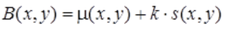

# Лабораторная работа №3 --- Обработка цифровых изображений

Петрикевич Т. --- студент 2 курса 14 группы ФПМИ

## Постановка Задачи

Написать приложение, реализующее следующие методы обработки
цифровых изображений:

    * Локальная пороговая обработка (2 Метода)
    * Адаптивная пороговая обработка
    * Высокочастотный фильтр для увеличения резкости изображения

В качестве методов локальной пороговой обработки были реализованы метод Бернсена
и метод Ниблэка.

Среди высокочастотных фильтров были выбраны фильтр Лапласса и Лапласса-Гаусса (LoG).

Интерфейс приложения предоставляет:

   1. Загрузку изображений и их конвертации в изображение в оттенках серого (для цветных)
   2. Отображение результата обработки в сравнении с исходным изображением
   3. Сохранение итогового изображения в формате .png

## Краткая Теория

### Метод Бернсена

1. Обычная квадратная апертура с нечетным числом пикселей пробегает в цикле по всем пикселям исходного изображения. На каждом шаге находится Min и Max.
2. Находится среднее значение Avg = (Min + Max) / 2.
3. Если текущий пиксель больше Avg < E — он становится белым, иначе — чёрным. E — некая константа заданная пользователем.
4. Если среднее меньше порога контраста — то текущий пиксель становится того цвета, который задавался параметром «цвет сомнительного пикселя».
Имеет ряд недостатков: после обработки монотонных областей яркости формируются сильные паразитные помехи, в некоторых случаях приводит к появлению ложных черных пятен

### Метод Ниблэка

Идея данного метода состоит в варьировании порога яркости B бинаризации от точки к точке на основании локального значения стандартного отклонения. Порог яркости в точке (x, y) рассчитывается так:

где μ(x, y) – среднее и s(x, y) — среднеквадратичное отклонение выборки для некоторой окрестности точки. Размер окрестности должен быть минимальным, но таким, чтобы сохранить локальные детали изображения. В то же время размер должен быть достаточно большим, чтобы понизить влияние шума на результат. Значение k определяет, какую часть границы объекта взять в качестве самого объекта. Значение k = -0.2 задает достаточно хорошее разделение объектов, если они представлены черным цветом, а значение k = +0.2, – если объекты представлены белым цветом.

## Технические Параметры

Инструменты разработки:

    * Средства разработки графического пользовательского интерфейса в Matlab R2016.a
    * Image Processing Toolbox 

Платформа: Windows
Разрешение: 1600 x 900

## Вывод

Подобрав соответствующую базу изображений, мы протестировали итоговое приложение.
На основании результатов можно сделать вывод о классах изображений, для
которых представленные в работе методы дают наилучший результат,
сравнить данные методы между собой, а также получить представление
о прикладном характере обработки цифровых изображений.

## Список Ресурсов и Источников

1. Comparative appraisal of global and local thresholding methods for binarisation of off-axis digital holograms, Pavel A. Cheremkhin, Ekaterina A. Kurbatova
2. Laplacian-Based Frequency Domain Filter for the Restoration of Digital Images Corrupted by Periodic Noise, Justin Varghese; Saudia Subash; Nasser Tairan; Bijoy Babu
