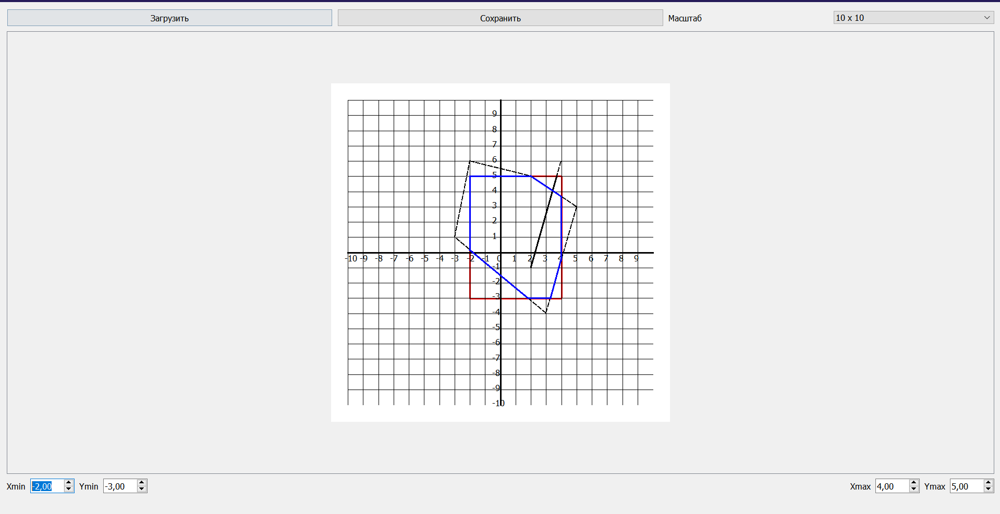

# Лабораторная работа №5 --- Отсечение Отрезков и Многоугольников

- [Лабораторная работа №5 --- Отсечение Отрезков и Многоугольников](#лабораторная-работа-5-----отсечение-отрезков-и-многоугольников)
  - [Постановка Задачи и Реализация](#постановка-задачи-и-реализация)
  - [Технические Параметры](#технические-параметры)
  - [Вывод](#вывод)

## Постановка Задачи и Реализация

Цель данной лабораторной заключалась в закреплении теоретического материала и практическом освоении основных алгоритмов отсечения отрезков и многоугольников.

Основными задачами которой являлись:

  1. Написать приложение/веб-приложение, которое иллюстрирует работу растровых алгоритмов.
  2. Реализовать базовые алгоритмы растеризации отрезков и кривых такие как:
    - пошаговый алгоритм
    - алгоритм ЦДА
    - алгоритм Брезенхема
    - алгоритм Брезенхема (окружность)

Реализованный функционал:

    - Загрузка данных из файла
    - Сохранение данных в файл
    - Отображение системы координат в основном поле приложения.
    - Выполнение отсечения отрезков алгоритмом Сазерленда-Коэна.
    - Реализация отсечения выпуклого многоугольника.

## Технические Параметры

Платформа: Windows

Использованные языки и среды программирования:

    - C++
    - Qt Creator

## Вывод

В ходе выполнения данной лабораторной:

  1. Было создано приложение в котором визуализируется работа алгоритмов отсечения отрезков и многоугольников.
  2. Был получен опыт работы с сеткой, осями координат и масштабом (который видоизменяется в зависимости от наших потребностей) в Qt.
  3. Был получен навык реализации основных алгоритмов отсечения отрезков и многоугольников.
  4. Закрепили работу с файловыми системами.
  5. Научились считывать  информацию с файла.
  6. Закрепили навык работы с GitHub.
