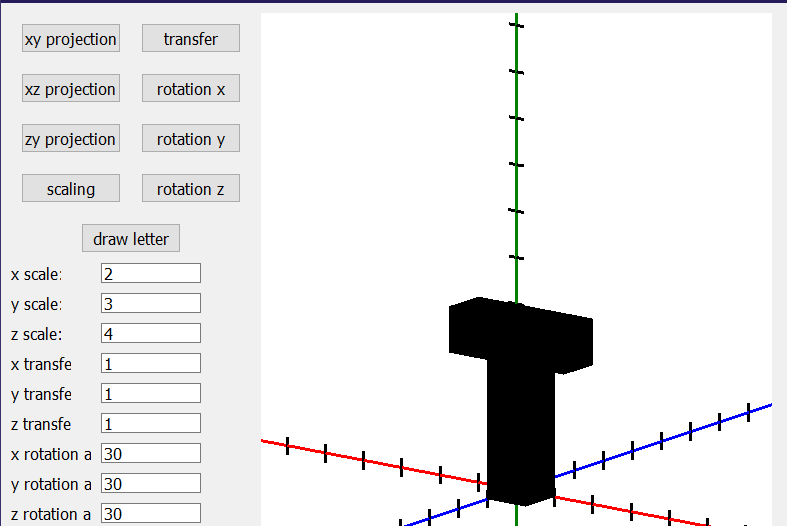

# Лабораторная работа №6 --- Трехмерное Моделирование

- [Лабораторная работа №6 --- Трехмерное Моделирование](#лабораторная-работа-6-----трехмерное-моделирование)
  - [Постановка задачи и реализация](#постановка-задачи-и-реализация)
  - [Технические Параметры](#технические-параметры)
    - [Библиотека OpenGL](#библиотека-opengl)
  - [Вывод](#вывод)

## Постановка задачи и реализация

Цель --- закрепление теоретического материала и
практическое освоение основных методов и алгоритмов трехмерной визуализации.

Задача --- Написать приложение-виджет, в котором формируется и визуализируется заданный трехмерный объект, его преобразования и двухмерное проецирование.

В качестве заданного объекта была использована трехмерная модель
первой буквы имени автора --- буквы Т.

Для реализации поставленной задачи была использована внутренняя библиотека QT ---
OpenGL. Построив массив вершин трехмерной модели, и массив индексации мы оптимизировали
процесс визуализации модели.

Реализованный функционал приложения:

    - Отображение первой буквы моей фамилии после нажатия кнопки "draw letter", а именно буквы "Ш".
    - Возможность выбора цвета буквы после нажатия кнопки "letter colour".
    - Задание масштабирования в LineEdits: "x scale", "y scale", "z scale".
    - Отображение полученного объекта после масштабирования с помощью кнопки "scaling".
    - Задание переноса трехмерного объекта в LineEdits: "x transfer", "y transfer", "z transfer".
    - Отображение полученного объекта после переноса с помощью кнопки "transfer".
    - Задание вращения вокруг произвольной оси в LineEdits: "rotation x", "rotation y", "rotation z".
    - Отображение полученного объекта после вращения с помощью кнопок: "rotation x", "rotation y", "rotation z".\
    

## Технические Параметры

Использованные языки и среды программирования:
    - C++
    - Qt Creator 4.11.1

Платформа --- Windows

### Библиотека OpenGL

    - Метод отрисовки --- GL_Draw_Elements
    - Форма отрисовки --- GL_QUADS (Четырехугольники)

## Вывод

По результатам 6 лабораторной изучен функционал библиотеки OpenGL для построения
и визуализации трехмерных объектов. Реализованы трехмерные преобразования заданного объекта такие как: масштабирование, перенос, вращение вокруг произвольной оси, а также три ортографические проекции с помощью матриц преобразования. Каждое из преобразований допускает задание параметров преобразования.
Так же реализована возможность выбора цвета визуализированного объекта.
