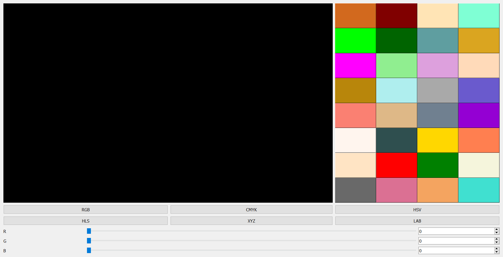

# Программирование Компьютерной Графики - Лабороторная 1

## Петрикевич Т, 14 Группа

### Содержание

- [Программирование Компьютерной Графики - Лабороторная 1](#программирование-компьютерной-графики---лабороторная-1)
  - [Петрикевич Т, 14 Группа](#петрикевич-т-14-группа)
    - [Содержание](#содержание)
    - [Выполняемые Задачи и Цели](#выполняемые-задачи-и-цели)
    - [Функциональные Возможности](#функциональные-возможности)
    - [Технические параметры](#технические-параметры)
    - [Список Ресурсов и Источников](#список-ресурсов-и-источников)

### Выполняемые Задачи и Цели

Приложение, позволяющее пользователю выбирать, а
затем интерактивно менять цвет, показывая при этом его составляющие в одной из
6 цветовых моделей: RGB, CMYK, HLS, HSV, CIE XYZ, CIE LAB.

Алгоритмы перевода цветов, между различными моделями написаны вручную на основе научных
материалов из различных источников.

Дружелюбный пользовательский интерфейс, на основе сеточной модели (QGridLayout):

### Функциональные Возможности

- 3 Способа задания цвета:
  - Плавная регулировка (Ползунки)
  - Ввод значений с клавиатуры
  - Точечный выбор с помощью цветовой палитры

- Автоматический пересчет показателей при смене цветовой модели
- Ненавязчивое предупреждение при неточном цветовом переводе
- Дружелюбный интерфейс

### Технические параметры

Инструменты разработки:

- QT / C++ (Framework)
- VS Code (Documentation)

Платформа: Windows

Минимальное разрешение: 480 x 360

Максимальное поддерживаемое разрешение экрана: 4k

### Список Ресурсов и Источников

1. Лекционный материал курса "Программирование Компьютерной Графики" - Василевский Константин Викторович
2. [Интернет Ресурс - Алгоритм Перевода "RGB <-> HSV"](https://www.had2know.org/technology/hsv-rgb-conversion-formula-calculator.html#:~:text=Converting%20RGB%20to%20HSV&text=H%20%3D%20360%20-%20cos-1,cosine%20is%20calculated%20in%20degrees)
3. [Интернет Ресурс - Зависимость между цветовыми моделями](https://stackoverflow.com/questions/39118528/rgb-to-hsl-conversion)
